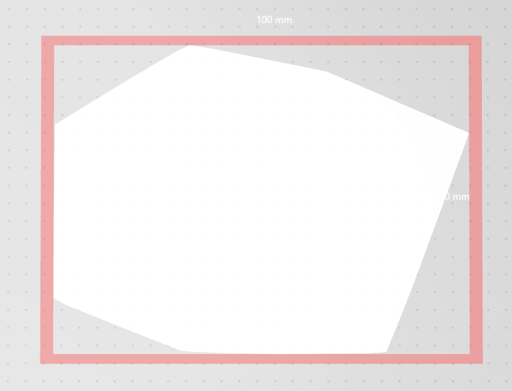

Report
======================================

Leave any comment about this report. I am not very sure if it satisfies your requirement, since the professor emphasized it's better to submit videos and we should write a lengthy report.

To compile all the code, do the following starting from assignment directory:

```bash
mkdir build
cd build
cmake -DCMAKE_BUILD_TYPE=Release ..
make
```


Ex.1: Convex Hull
-----------------

### Code

You can launch the program as follows:

```bash
./convex_hull ../data/points.xyz output.obj
```

You should be able to open the resulting file with [Meshlab](http://www.meshlab.net/):

```bash
meshlab output.obj
```

### Tasks

I simply implemented Graham's algorithm and filled in all TODOs.

Note:

* I introduced `eps = 1e-7`.
* When sorting points, in the comparison function, if the angles of the two vectors are the same, then I sort them according to their length. This can deal with a convex hull that is a single segment.
* In function `save_obj`, I changed drawing multiple lines to a single polygon in one line. This is for visualization (otherwise I am unable to open this file).

### Result

I used Print 3D on Windows to open `output.obj`:



Ex.2: Point In Polygon
----------------------

### Code

Run the code as follows:

```bash
./point_in_polygon ../data/points.xyz ../data/polygon.obj result.xyz
```

### Tasks

I made an assumption that the intersection of the line from the outside point to the query point and the polygon will not be a point at a vertex of the polygon or a segment on an edge. By randomizing the outside point, it is very likely that the assumption is true, so the implementation is largely simplified.

When testing and computing the intersection of two segments $[a, b]$ and $[c, d]$, I get this equation:
$$
a + \lambda_u (b - a) = c + \lambda_v (c - d)
$$
This is a linear equation. I used Cramer's rule to solve $\lambda_u$ and $\lambda_v$. If both of them are in $[0, 1]$, then the segments intersect, otherwise not.

### Result

You may use any tool to visualize the result points in `result.xyz`. I used matplotlib in Python to plot these points, but I unintentionally deleted it under the `build` directory. The result is the same as yours.
