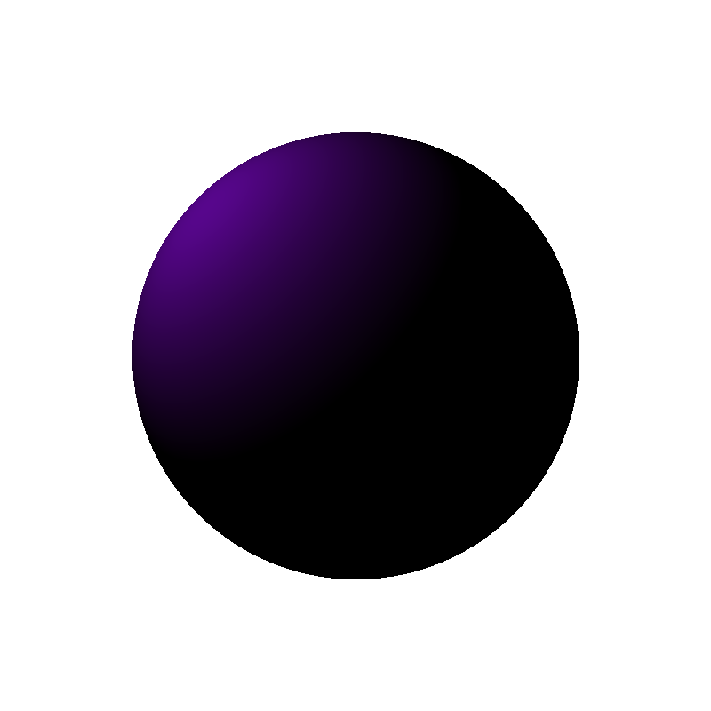
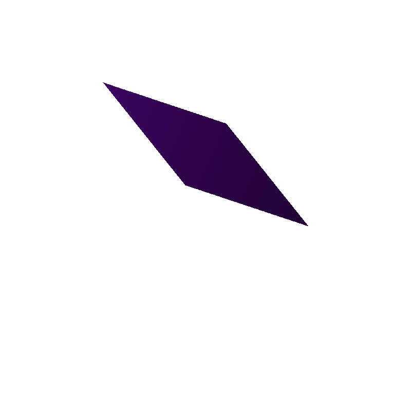
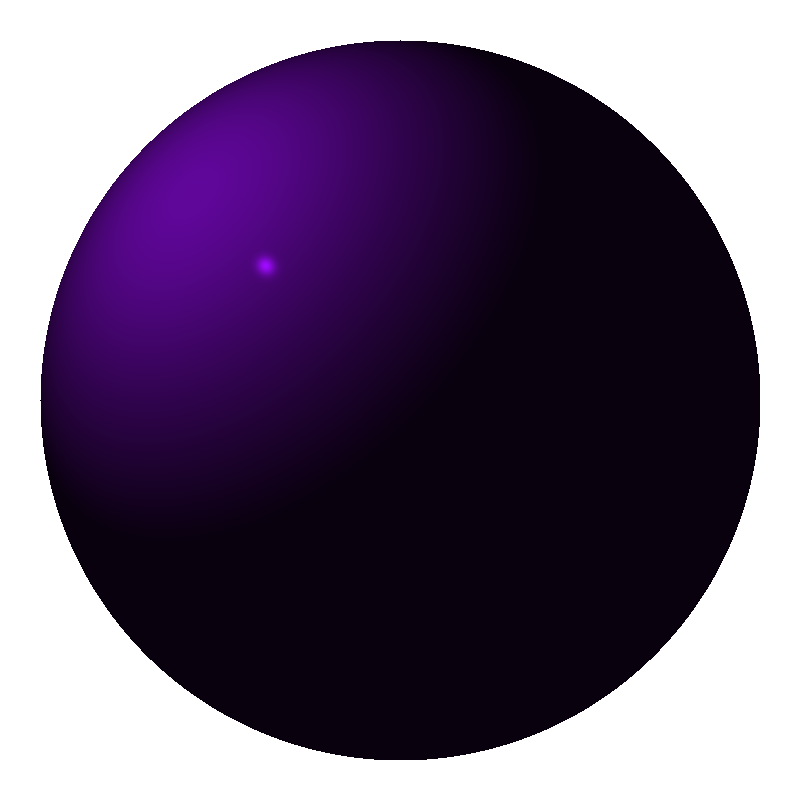

Assignment #2
======================================

Use the same way to compile the code as suggested.

I only modified [src/main.cpp](src/main.cpp). I largely refactored the code by abstracting the `raytrace` function, objects, and many arguments so that it's easier to systematically try different combinations.

Ex.1: Basic Ray Tracing
-----------------------

### Tasks

#### Ray Tracing a Sphere
1. Replace the ad-hoc ray sphere intersection algorithm with the generic one derived in class.

   I simply implemented the equations on the slides (solving the quadratic equation) in `Sphere::intersect_with_ray`. The sphere is defined in the `sphere` object in the main function.

#### Ray Tracing a Parallelogram
1. Set up the parameters of the parallelogram (position of the corner, plus one vector for each side of the parallelogram)

   The parallelogram is defined in the `pgram` object in the main function. 

2. Create a function to check if a ray intersects with an arbitrary parallelogram.

   Implemented in `Parallelogram::intersect_with_ray`. The basic idea is to solve the 3-order equation system (or the coordinates in the basis, as I wrote in the doc of the function), which is the same as the approach of ray-triangle intersection on the slides.

3. Calculate the intersection between the ray and the parallelogram using the function defined above.

   Discussed as above.

4. Compute the normal of that intersection point.

   Since it's on a plane, the normal is always on the same direction on the same surface. It could be normalized from the cross-product of the two vectors of the parallelogram. The only thing we need to ensure is that the normal points to the face of ray origin.

#### Ray Tracing with Perspective Projection
5. Modify the ray equation for perspective projection.

   Simply change the ray direction from the point on the screen to the direction from the perspective point.

6. Compare the difference in the result for a sphere, for a parallelogram (you can also create a scene with multiple objects).

   Compare the sphere in orthographic and perspective projection:

   

   

   Not very different, since it's sphere.

   Comparing the parallelogram in orthographic and perspective projection:

   

   

Ex.2: Shading
-------------

### Tasks

1. Implement the basic shading components discussed in class: ambient, specular, and diffuse.

   Here is an example sphere:

   

2. Add RGB components instead of the current grey-scale one.

   As I show above, I added purple color.

3. Experiment with the different parameters and observe their effect on the ray-traced shaped.

   ambient makes all parts brighter or darker.

   specular controls the size of the bright dot on the sphere.

   diffuse controls the intensity of the large reflection area.
