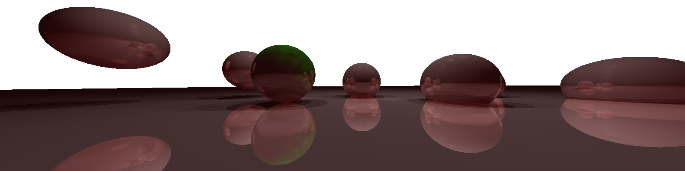

Assignment #3
========================

Use the same way to compile the code as suggested:

```bash
cd Assignment_3
mkdir build
cd build
cmake ..
make
```

Then you will get the compiled executable `assignment3`.

I provided multiple command line arguments for the executable:

* `--filename [filename]`: The filename of the output image. Default to `raytrace.png`.
* `--focal_length [focal_length]` or `-f [focal_length]`: The focal length. Default to 10.
* `--field_of_view [field_of_view]`:The field of view in degree. Default to 45.
* `--projection_type [projection_type]` or `-p [projection_type]`: The projection type, either `orthographic` (`o`) or `perspective` (`p`). Default to `perspective`.
* `--obj_specular_exponent [obj_specular_exponent]`: The `obj_specular_exponent` in the original code.
* `--eta [eta]` or `-e [eta]`: The $\eta$ used in refraction. I will introduce this in the refraction section.
* `--s_fraction [s_fraction]`: Used in refraction. I will introduce this refraction section.
* `--max_bounce [max_bounce]` or `-b [max_bounce]`: Max number of bounces for reflection/refraction. Default to 5.
* `--grid_size [grid_size]` or `-g [grid_size]`: The grid size in the original code used in Perlin noise. Default to 20.
* `--stddev [stddev]`: Used to sample deviating start rays. Default to 0.
* `--n_sample [n_sample]`: Number of samples for deviating start rays. Default to 1.
* `-w [w]`: Width of the image in pixel. Default to 800.
* `-h [h]`: Height of the image in pixel. Default to 400.

Ex 1: Field of View and Perspective Camera from Assignment 2
------------------------------------------

Output with orthographic camera (by running `./assignment3 --projection_type orthographic --filename ../img/my-fov-res.png`):


Output with orthographic camera (by running `./assignment3 --projection_type perspective --filename ../img/my-perspective.png`):


Ex.2: Shadow Rays
-----------------

Output with correct shading and shadows (by running `./assignment3 --projection_type perspective --filename ../img/my-perspective.png`):


Ex.3: Reflection
-----------------------

Output with reflections (by running `./assignment3 --projection_type perspective --filename ../img/my-perspective.png`):


Ex.4: Perlin Noise
-------------------------

Output with linear interpolation (by running `./assignment3 --projection_type perspective --filename ../img/my-perspective.png`):


Output with cubic interpolation (by running `./assignment3 --projection_type perspective --filename ../img/my-perspective.png`):


Starting Code
-------------


After implementing the perspective camera, specular highlights, shadows, reflections, and Perlin noise, the result of  my code (by running `./assignment3 --projection_type perspective --filename ../img/my-perspective.png`):


Ex 5: Depth of Field
------------------------------

I used Gaussian distribution centered at the original camera point with standard deviation `stddev` to sample the start point of the ray.

To see the whole picture, from now on, I will use a wide image with larger field of view (by running `./assignment3 -w 1600 --field_of_view 75 --filename ../img/wide.png`):


I am a bit lazy here so I change the focal length instead of the scene. This is the result with focal length 4 and 25 samples with stddev=0.05 for each pixel (by running `./assignment3 -w 1600 --field_of_view 75 -f 4 --stddev 0.05 --n_sample 25 --filename ../img/wide_f4.png`):


You can see the closer spheres are shaper than farther ones.

And this is the result with focal length 6 and 25 samples with stddev=0.05 for each pixel (by running `./assignment3 -w 1600 --field_of_view 75 -f 6 --stddev 0.05 --n_sample 25 --filename ../img/wide_f6.png`):


You can see the farther spheres are shaper than closer ones.

Ex 6: Refractions
------------------------------

### Tasks

1. Derive the formula for the direction of the refracted ray based on the Snell-Descartes law.
2. Implement the refraction color while being sure to check for total internal reflection (there may be no refracted ray if the incident direction is too low).

The Snell-Descartes law:
$$
\eta_1 \sin \theta_1 = \eta_2 \sin \theta_2
$$
where $\eta$s are the refractive indexes of the material on each side. Therefore, we have to set $\eta_0$ for the empty space and $\eta$ inside the objects. Since the law only requires the ratio $\eta_1 : \eta_2$, I set $\eta_0 = 1$, so you can set $\eta$. The effect of $\eta$ is:

* When $\eta > \eta_0 = 1$, objects mimic denser transparent materials. For example, $\eta = 1.333$ for water, $\eta = 1.69$ for flint glass.
* When $\eta < \eta_0 = 1$, objects mimic less denser transparent materials. For example, $\eta = 1/1.333$ for air in water.
* When $\eta = \eta_0 = 1$, there is no reflection (but we can still see the ambient and diffuse colors).
* When $\eta \in \{0, +\infty\}$, there is only reflection and no refraction, so the result looks the same as previous ones.

When computing the refraction, we must know which side is inside/outside. So I guarantee that the norm vectors returned by ray intersection function point out.

Another detail I implemented is how much of the light is reflected and how much (the rest) of the light is refracted. I followed [Fresnel equations](https://en.wikipedia.org/wiki/Fresnel_equations), which depend on the fraction of s-polarized and p-polarized light. The `s_fraction` is the fraction of s-polarized light in the mixed light. Note that implementing this will make the result darker, since the total amount of light get reduced through each reflection/refraction according to the colors.

Here are several examples for different $\eta$s (by running `./assignment3 -w 1600 --field_of_view 75 --eta ${eta} --filename ../img/wide_eta_${eta}.png`):

$\eta = 0$: 

$\eta = 0.75$: 

$\eta = 1$: 

$\eta = 1.333$: 

$\eta = 1.69$: 

$\eta = 10$: 

$\eta = +\infty$ (default): 
